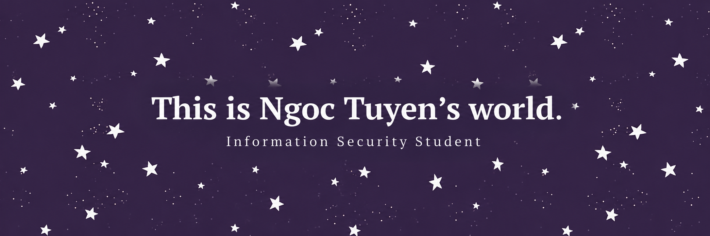

<h2>Hey there! I’m Ngọc Tuyền</h2>

<!-- ## 👋 &nbsp;Hey there! I'm Ngọc Tuyền -->
<h3 id="-about-me">👨🏻‍💻 &nbsp;About Me</h3>

💡 &nbsp;I like to explore new technologies and develop software solutions and quick hacks. 
🎓 &nbsp;I’m currently studying Information Security at Ho Chi Minh City University of Industry and Trade. 
🌱 &nbsp;I’m on track for learning more about Application Security. 
🎧 &nbsp;In my free time, I usually listen to music or go for a walk to relax. 
📧 &nbsp;You can shoot me an email at <a href="ngoctuyen31031999@gmail.com">ngoctuyen31031999@gmail.com</a>! I’ll try to respond as soon as I can. 

<h3 id="-tech-stack">🛠 &nbsp;Tech Stack</h3>

&nbsp;
&nbsp;
&nbsp;
&nbsp;
&nbsp;
&nbsp;
<h3 id="-Contact-with-me">🤝🏻 &nbsp;Contact with Me</h3>

Credits: <a href="https://github.com/ngoktyn">ngoktyn</a>

Last Edited on: 01/10/2026
 
